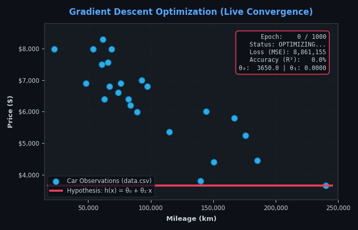

<table width="100%">
  <tr></tr>
  <tr>
    <td colspan="2" align="center">
      <h1>🚗 42 FT_LINEAR_REGRESSION</h1>
      <h3>Car Price Prediction from Scratch via Batch Gradient Descent</h3>
      

        
        
        
        
        
      

      

        
        
        
      

    </td>
  </tr>
  <tr></tr>
  <tr>
    <td width="55%">
      

        🎯 <strong>Mission & Objective:</strong> 
        Implementation of a univariate <strong>Linear Regression model from raw mathematical first principles</strong> to predict used car prices from mileage (<code>km</code> $\to$ <code>price</code>).
      

      

        🛡️ <strong>Zero-Cheating Architecture:</strong> 
        Strictly zero usage of black-box ML solvers (<code>np.polyfit</code>, <code>sklearn.linear_model</code>, <code>scipy.optimize</code>). All gradients, loss surfaces, and parameter update steps are derived analytically and coded by hand.
      

      

        ⚡ <strong>Numerical Stability & Feature Scaling:</strong> 
        Addresses numerical gradient explosion caused by large kilometer magnitudes ($240,000\text{ km}$) via handcrafted Min-Max normalization $[0.0, 1.0]$ coupled with closed-form analytical parameter de-normalization.
      

      

        🌐 <strong>Interactive Masterclass:</strong> 
        Includes an interactive educational journey deployed to <strong>GitHub Pages</strong> with live gradient simulation, step-by-step trace tables, and cost decay visualizers.
      

    </td>
    <td width="45%" align="center">
      
      

        <em>Live Batch Gradient Descent Convergence (Actual Dataset)</em>
      

    </td>
  </tr>
</table>

<table width="100%" align="center">
  <tr></tr>
  <tr>
    <td colspan="3" align="center">
      <h3>📐 Mathematical Formulation & First Principles</h3>
    </td>
  </tr>
  <tr></tr>
  <tr>
    <td width="25%"><strong>Concept</strong></td>
    <td width="40%"><strong>Mathematical Formulation</strong></td>
    <td width="35%"><strong>Computational Implementation</strong></td>
  </tr>
  <tr></tr>
  <tr>
    <td><strong>Linear Hypothesis</strong></td>
    <td>$$h_\theta(x) = \theta_0 + (\theta_1 \cdot x)$$</td>
    <td>Vectorized evaluation: <code>self.theta0 + (self.theta1 * arr_x)</code></td>
  </tr>
  <tr></tr>
  <tr>
    <td><strong>Cost Function (MSE Loss)</strong></td>
    <td>$$J(\theta_0, \theta_1) = \frac{1}{2m} \sum_{i=0}^{m-1} (h_\theta(x^{(i)}) - y^{(i)})^2$$</td>
    <td>Calculates half Mean Squared Error across all training observations.</td>
  </tr>
  <tr></tr>
  <tr>
    <td><strong>Analytical Gradients</strong></td>
    <td>
      $$\frac{\partial J}{\partial \theta_0} = \frac{1}{m} \sum_{i=0}^{m-1} (h_\theta(x^{(i)}) - y^{(i)})$$ 
      $$\frac{\partial J}{\partial \theta_1} = \frac{1}{m} \sum_{i=0}^{m-1} (h_\theta(x^{(i)}) - y^{(i)}) \cdot x^{(i)}$$
    </td>
    <td>Simultaneous exact partial derivatives computed with zero numerical approximation.</td>
  </tr>
  <tr></tr>
  <tr>
    <td><strong>Simultaneous Parameter Updates</strong></td>
    <td>
      $$\text{tmp}_0 = \theta_0 - \alpha \frac{\partial J}{\partial \theta_0}$$ 
      $$\text{tmp}_1 = \theta_1 - \alpha \frac{\partial J}{\partial \theta_1}$$
    </td>
    <td>Synchronous parameter update via temporary buffers preventing gradient leakage.</td>
  </tr>
  <tr></tr>
  <tr>
    <td><strong>Parameter Unscaling</strong></td>
    <td>
      $$\theta_1^{real} = \theta_1^{norm} \cdot \left(\frac{y_{max} - y_{min}}{x_{max} - x_{min}}\right)$$ 
      $$\theta_0^{real} = y_{min} + \theta_0^{norm} \Delta y - \theta_1^{real} x_{min}$$
    </td>
    <td>Analytical transformation mapping scaled weights back to physical real-world units ($/km).</td>
  </tr>
</table>

<table width="100%">
  <tr></tr>
  <tr>
    <td colspan="3" align="center">
      <h3>📦 42 Deliverables Contract & Executables</h3>
    </td>
  </tr>
  <tr></tr>
  <tr>
    <td width="20%"><strong>Executable</strong></td>
    <td width="15%"><strong>Category</strong></td>
    <td width="25%"><strong>Terminal Command</strong></td>
    <td width="40%"><strong>Scope & Expected Output</strong></td>
  </tr>
  <tr></tr>
  <tr>
    <td><code>train.py</code></td>
    <td>Mandatory</td>
    <td><code>make train</code></td>
    <td>Lê <code>dataset/data.csv</code>, treina o modelo via Batch Gradient Descent e exporta <code>thetas.json</code>.</td>
  </tr>
  <tr></tr>
  <tr>
    <td><code>predict.py</code></td>
    <td>Mandatory</td>
    <td><code>make predict</code></td>
    <td>Prompt interativo para estimativa de preço por quilometragem com fallback para $\theta=0$.</td>
  </tr>
  <tr></tr>
  <tr>
    <td><code>plot.py</code></td>
    <td>Bonus</td>
    <td><code>make plot</code></td>
    <td>Renderiza dispersão de dados, reta de regressão ajustada e curva de custo $J(\theta)$ ao longo das épocas.</td>
  </tr>
  <tr></tr>
  <tr>
    <td><code>evaluate_metrics.py</code></td>
    <td>Bonus</td>
    <td><code>make precision</code></td>
    <td>Avalia métricas estatísticas: Coeficiente de Determinação ($R^2 \ge 0.73$), $MSE$, $RMSE$ e $MAE$.</td>
  </tr>
</table>

<table width="100%">
  <tr></tr>
  <tr>
    <td colspan="3" align="center">
      <h3>🕹️ Command Center & Quality Gates (Makefile)</h3>
    </td>
  </tr>
  <tr></tr>
  <tr>
    <td width="25%"><strong>Target</strong></td>
    <td width="25%"><strong>Category</strong></td>
    <td width="50%"><strong>Action & Quality Check</strong></td>
  </tr>
  <tr></tr>
  <tr>
    <td><code>make onboarding</code></td>
    <td>Developer Experience</td>
    <td>Exibe guia de boas práticas, padrões de branch, formato de commits e regras institucionais.</td>
  </tr>
  <tr></tr>
  <tr>
    <td><code>make install</code></td>
    <td>Setup & Tooling</td>
    <td>Instala dependências do projeto em modo editável e configura os git hooks em <code>.githooks/</code>.</td>
  </tr>
  <tr></tr>
  <tr>
    <td><code>make audit</code></td>
    <td>Quality Gate 42</td>
    <td>Valida compilação Python 3.10, auditor AST Anti-Cheating e executa 100% da suíte de testes unitários.</td>
  </tr>
  <tr></tr>
  <tr>
    <td><code>make check</code></td>
    <td>Sanity Check</td>
    <td>Executa bateria de linters pré-commit: Black, isort, flake8, ruff e scanner de secrets.</td>
  </tr>
  <tr></tr>
  <tr>
    <td><code>make test</code></td>
    <td>Automated Tests</td>
    <td>Roda suíte completa de testes unitários e de integração (21+ testes automatizados).</td>
  </tr>
  <tr></tr>
  <tr>
    <td><code>make clean</code></td>
    <td>Maintenance</td>
    <td>Remove caches temporários (<code>__pycache__</code>, <code>.pytest_cache</code>, <code>thetas.json</code>, <code>summary.md</code>).</td>
  </tr>
</table>

<table width="100%">
  <tr></tr>
  <tr>
    <td colspan="2" align="center">
      <h3>🏛️ Repository Architecture & Engineering Modules</h3>
    </td>
  </tr>
  <tr></tr>
  <tr>
    <td width="35%"><strong>Module / Directory</strong></td>
    <td width="65%"><strong>Architectural Responsibility</strong></td>
  </tr>
  <tr></tr>
  <tr>
    <td><code>src/model/</code></td>
    <td>Núcleo de Regressão Linear: cálculo analítico de gradientes, função de custo MSE e Batch Gradient Descent.</td>
  </tr>
  <tr></tr>
  <tr>
    <td><code>src/preprocessing/</code></td>
    <td>Pipeline de dados: carregador de CSV e normalizador Min-Max com desnormalização paramétrica analítica.</td>
  </tr>
  <tr></tr>
  <tr>
    <td><code>src/visualization/</code></td>
    <td>Módulo de plotagem gráfica: dispersão de pontos, reta ajustada e convergência da curva de perda.</td>
  </tr>
  <tr></tr>
  <tr>
    <td><code>tests/unit/</code></td>
    <td>Pirâmide de testes unitários com validação contra valores exatos da lousa didática e decaimento monotônico.</td>
  </tr>
  <tr></tr>
  <tr>
    <td><code>scripts/</code></td>
    <td>Auditor AST Anti-Cheating, Milestone Release Bot, linters de governança de branch/commit e avaliador de métricas.</td>
  </tr>
  <tr></tr>
  <tr>
    <td><code>.github/workflows/</code></td>
    <td>Pipelines CI/CD: Quality Gate rigoroso, auto-fechamento de PRs fora do padrão e deploy no GitHub Pages.</td>
  </tr>
</table>

